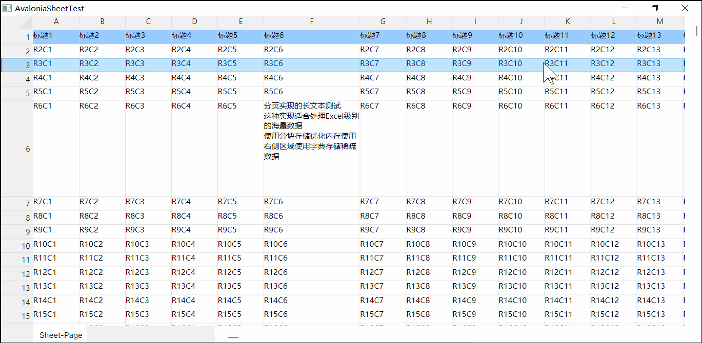

# Avalonia Sheet

**A lightweight Excel-like grid control for Avalonia UI with virtualized rendering and customizable data sources** ✨



---

## Features

- ⭐️ **Excel-like Grid Interface** - Spreadsheet UI with cells, rows and columns
- ⭐️ **High Performance Rendering** - Optimized for large datasets with virtualized rendering(Can support 1048576 *  16384)
- ⭐️ **Memory-Efficient Design** - Leverages C#'s efficient memory layout for massive datasets (1M+ rows demo)
- ⭐️ **Customizable Data Source** - Implement `ISheetData` interface for your data backend
- **Row/Column Resizing** - Interactive resizing of rows and columns with mouse
- **Smooth Scrolling** - Both vertical and horizontal scrolling with scrollbar synchronization
- **Cell Selection** - Visual highlighting of selected cells
- **In-place Editing** - Double-click cells to edit content
- **Header Customization** - Customizable row and column headers
- **Pixel-perfect Layout** - Precise measurement and alignment of all elements
- **Theming Support** - Styled using Avalonia's Fluent theme system
- **Two Data Implementations Included**:
  - `SheetDataArrayImpl` - Simple array-based storage
  - `SheetDataPageImpl` - Advanced paged memory model for large datasets
- **Extensible Architecture** - Easy to add new features and customizations

## Getting Started

```bash
git clone https://github.com/orunco/AvaloniaSheet.git
cd AvaloniaSheet
dotnet run
```

## Requirements

- .NET 6+
- Avalonia 11+

### Why? 

When there are already countless Sheet UI controls available, why build another one? Three key reasons:

1. **Project Necessity**
   After extensive technical evaluation for our project, we determined Avalonia was the most suitable framework. However, we discovered Avalonia's ecosystem only offers a DataGrid control (which is quite cumbersome to use) and lacks a proper Sheet component. This forced us to build our own minimal viable implementation to validate feasibility.

   The development process revealed Avalonia's immaturity - creating such a highly interactive control proved exceptionally challenging. Fortunately, the advent of AI tools significantly boosted our productivity.

   *Why Avalonia?*
   Our use case involves extreme data scales (1,048,576 × 16,384 cells) where memory control is mandatory - web-based solutions simply can't handle this load. C# can handle this situation, and we have demonstrated it with strong practice.

2. **Just for FUN**
   Because engineering passion drives innovation.

3. **Tribute**
   Honoring the pioneers who paved the way. 

   https://www.willcoxson.net/wcmfclib.htm

   I still don't understand. Back in 1996, predecessors had already implemented the Datagrid component, yet by 2025, it seems the Avalonia community still hasn't achieved it—at least, I haven't found it yet.

## License

MIT © Pete Zhang @ Orunco